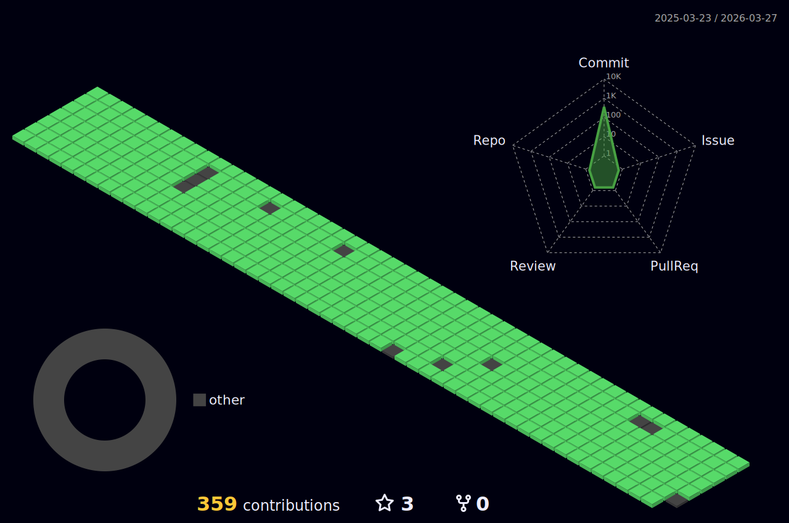

## 📟 I'm a Final Year CS undergrad @ NUS School of Computing 

```cpp
MatrixObject Me = new Person("Timothy Young", 1997);
```
🎧 _Vibe with me_ 🎺

[](https://open.spotify.com/user/31qd72w5v25ss2gn6tpaoaenqfru)


> ### 🤝🏼 Connect with me:

[][linkedin]
[][twitter]
[][email]
[][facebook]

<br />
<br />

> ### 📕 Latest Blog Posts

<!-- BLOG-POST-LIST:START -->
- [Git Commands!](https://dev.to/timothyoung97/git-commands-3pkh)
<!-- BLOG-POST-LIST:END -->

## ⚡ GitHub Stats Panel

<details>
  <summary>♾️📶🆙</summary>

  <h4><i>Recent Activities</i></h2>

<!--START_SECTION:activity-->
1. 🔓 Reopened issue [#5](https://github.com/Timothyoung97/RenderingEngine/issues/5) in [Timothyoung97/RenderingEngine](https://github.com/Timothyoung97/RenderingEngine)
2. 🔒 Closed issue [#5](https://github.com/Timothyoung97/RenderingEngine/issues/5) in [Timothyoung97/RenderingEngine](https://github.com/Timothyoung97/RenderingEngine)
3. 🗣 Commented on [#5](https://github.com/Timothyoung97/RenderingEngine/issues/5#issuecomment-2077788236) in [Timothyoung97/RenderingEngine](https://github.com/Timothyoung97/RenderingEngine)
4. 🗣 Commented on [#5](https://github.com/Timothyoung97/RenderingEngine/issues/5#issuecomment-2072323840) in [Timothyoung97/RenderingEngine](https://github.com/Timothyoung97/RenderingEngine)
5. 🗣 Commented on [#5](https://github.com/Timothyoung97/RenderingEngine/issues/5#issuecomment-2071460692) in [Timothyoung97/RenderingEngine](https://github.com/Timothyoung97/RenderingEngine)
<!--END_SECTION:activity-->

---

<h4><i>General Stats</i></h2>

  <p align="center">
    <code></code>
    <code></code>
  </p>  

---

<h4><i>Activity</i></h2>

  <p align="center">
    <code></code>
  </p>  

---

<h4><i>Contribution Graph</i></h2>

  <p align="center">
    <code></code>
  </p>  

---

<h4><i>Wakatime Stats</i></h2>
    
<!--START_SECTION:waka-->


**🐱 My GitHub Data** 

> 📦 2.2 MB Used in GitHub's Storage 
 > 
> 🏆 801 Contributions in the Year 2024
 > 
> 💼 Opted to Hire
 > 
> 📜 25 Public Repositories 
 > 
> 🔑 25 Private Repositories 
 > 
**I'm an Early 🐤** 

```text
🌞 Morning                4809 commits        ███░░░░░░░░░░░░░░░░░░░░░░   13.19 % 
🌆 Daytime                19111 commits       █████████████░░░░░░░░░░░░   52.41 % 
🌃 Evening                8884 commits        ██████░░░░░░░░░░░░░░░░░░░   24.37 % 
🌙 Night                  3657 commits        ███░░░░░░░░░░░░░░░░░░░░░░   10.03 % 
```
📅 **I'm Most Productive on Wednesday** 

```text
Monday                   6398 commits        ████░░░░░░░░░░░░░░░░░░░░░   17.55 % 
Tuesday                  5405 commits        ████░░░░░░░░░░░░░░░░░░░░░   14.82 % 
Wednesday                6684 commits        █████░░░░░░░░░░░░░░░░░░░░   18.33 % 
Thursday                 5454 commits        ████░░░░░░░░░░░░░░░░░░░░░   14.96 % 
Friday                   3462 commits        ██░░░░░░░░░░░░░░░░░░░░░░░   09.50 % 
Saturday                 6423 commits        ████░░░░░░░░░░░░░░░░░░░░░   17.62 % 
Sunday                   2635 commits        ██░░░░░░░░░░░░░░░░░░░░░░░   07.23 % 
```


📊 **This Week I Spent My Time On** 

```text
🕑︎ Time Zone: Asia/Singapore

💬 Programming Languages: 
No Activity Tracked This Week

🔥 Editors: 
No Activity Tracked This Week

🐱‍💻 Projects: 
No Activity Tracked This Week

💻 Operating System: 
No Activity Tracked This Week
```

**I Mostly Code in C++** 

```text
C++                      8 repos             ██████░░░░░░░░░░░░░░░░░░░   25.00 % 
Python                   5 repos             ████░░░░░░░░░░░░░░░░░░░░░   15.62 % 
HTML                     2 repos             ██░░░░░░░░░░░░░░░░░░░░░░░   06.25 % 
Makefile                 1 repo              █░░░░░░░░░░░░░░░░░░░░░░░░   03.12 % 
HLSL                     1 repo              █░░░░░░░░░░░░░░░░░░░░░░░░   03.12 % 
```


**Timeline**


 Last Updated on 08/07/2024 18:42:40 UTC
<!--END_SECTION:waka-->
    
</details>

[facebook]: https://www.facebook.com/TimYoung97
[email]: mailto:e0518553@u.nus.edu
[twitter]: https://twitter.com/timothyoung97
[linkedin]: https://www.linkedin.com/in/shiyuan-yang97/

<div>Icons made by <a href="https://www.freepik.com" title="Freepik">Freepik</a> from <a href="https://www.flaticon.com/" title="Flaticon">www.flaticon.com</a></div>
